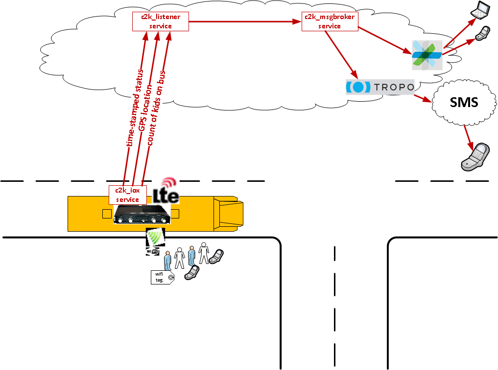
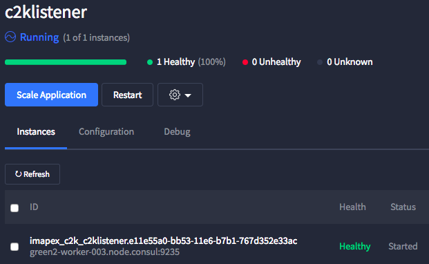

# Cisco Kiddie Kounter (C2K): Listener Service

Cisco Kiddie Kounter (C2K) is a sample demonstration application that illustrates how several technologies from Cisco can be brought together to address a business problem.  

## Demo Application Background

The initial problem to be solved is to to count the kids on the school bus.  Additional capabilities include tracking school bus location and notifying school administrators and parents.  No more kids left sleeping on the bus!



The total application consists of the following services:

* [c2k_demo](https://github.com/imapex/c2k_demo) - Full Demo Application Setup and Details
* [c2k_iox](https://github.com/imapex/c2k_iox) - Details on the Cisco IOx Client Application
* [c2k_listener](https://github.com/imapex/c2k_listener) - Centralized services for receiving bus updates from IoX and maintaining database
* [c2k_msg](https://github.com/imapex/c2k_msg) - Messaging services via Cisco Spark or Tropo

# c2k_listener 

This repository provides the code and details for the C2K Listener Service. The C2K Listener Service listens for updates and data pushed to the listener from one or more C2K IOx applications running on a Cisco 829 router. The listener will receive and store data such as status, GPS coordinates, kids currently on board the bus, and more. Interesting information such as status changes, bus location, kid count, and more can trigger notifications via Spark or SMS via the messaging service.

For phase 1 of C2K, the listener service will simply listen for bus heartbeat messages that indicate the bus is online and in service. When a bus comes online, a Spark message will be triggered in a Spark room. If several minutes go by without a heartbeat from the router, the listener will take the bus offline and trigger a Spark message in the Spark room.

Additional capabilities such as a persistent database, kid data, GPS tracking, and additional triggered alerts will be added in a future phase.

### Table of Contents 

* [Setup and PreRequisites](#setup-and-prerequisites)
* [Loading Demo Application](#loading-demo-application)

# Setup and PreRequisites 

To build and replicate this demonstration you'll need to ensure the other components of C2K are installed and functional including the C2K IOx application on a Cisco 829 router and the messenger service. In addition, you will need access to a lab environment running the Mantl stack to deploy this service into. 

## Other C2K Componenets 

In addition to the C2K Listener Service, this demo requires the C2K IOx service running on a Cisco 829 router and the C2K Messenger Service running somewhere that is accessible by the C2K Listener.

Instructions for installing and configuring these other services can be found here:

* [c2k_demo](https://github.com/imapex/c2k_demo) - Full Demo Application Setup and Details
* [c2k_iox](https://github.com/imapex/c2k_iox) - Details on the Cisco IOx Client Application
* [c2k_msg](https://github.com/imapex/c2k_msg) - Messaging services via Cisco Spark or Tropo

# Installing the C2K Listener Service

Begin by cloning the c2k_listener repository to your local machine.  

```
git clone https://github.com/imapex/c2k_listener

# View the contents of the repo, you should see something similar
ls
Dockerfile			c2k_listener.py
README.md			requirements.txt
app_install.sh		sample-c2k_listener.json
app_uninstall.sh

```

## C2K Listener Service Installation

Follow these steps to install the C2K Listener Service into a lab Mantl stack.  

*All of these steps will be accomplished from a terminal on your workstation*

1. Look at your c2k_listener app directory.  You should see the following files.  

	```
	ls -la
	```
	
	| File | Description |
	| --- | --- | 
	| Dockerfile | The Docker config file describing the container |
	| app_install.sh | Shell script used to create the C2K Listener service in Mantl | 
	| app_uninstall.sh | Shell script used to delete the C2K Listener service from the Mantl environment | 
	| c2k_listener.py | Primary python code for the C2K Listener service|
	| requirements.txt | Python requirements list | 
	| sample-c2k_listener.json | Sample application configuration file used by app_install.sh | 
	

2. The `app_install.sh` script will be used to capture the various settings needed to launch the service and will configure the service within the Mantl stack. Execute this script and follow the prompts to deploy the service.

    ```
     ./app_uninstall.sh
     
    Please provide the following details on your lab environment.

	What is the address of your Mantl Control Server?  
	eg: control.mantl.internet.com 
	
	control.mantl.test.com
	
	What is the username for your Mantl account?  
	user1

	What is the password for your Mantl account?  
	secretpassword

	What is the your Docker Username?  
	user1

	What is the URL to the Spark Message Broker Service?  
	imapex-c2k-c2kmsgbroker.app.test.com

	What is the Spark app key you will use for this demo?  
	bus-01-dfd45h6t7d
 
	***************************************************
	Installing the demoapp as  imapex/c2k/c2klistener
	***************************************************

	Installed
	Wait 2-3 minutes for the service to deploy. 

	You can also watch the progress from the GUI at: 

	https://control.mantl.test.com/marathon	
	
	```
    
3. Navigate to the Marathon Web GUI and validate the service is online and healthy.

   

4. Test the service by sending a curl command that retrieves information on all registered busses.  

	```
	curl -k -X GET http://imapex-c2k-c2klistener.mantl.test.com/api/v1.0/busses \
	| python -m json.tool
	
	{
    "busses": [
        {
            "id": 1,
            "last_checkin": "06:05:00",
            "last_location": "12345",
            "name": "bus0648",
            "route": "Chicago North 5",
            "status": "offline",
            "uri": "http://imapex-c2k-c2klistener.mant.test.com/api/v1.0/busses/bus0648"
        }
    	]
	}	
	```

5. If the C2K Messenger Service has already been deployed, you can validate the Messenger service connectivity by triggering a status change using curl. 

	```
	curl -k -X PUT http://imapex-c2k-c2klistener.mantl.test.com/api/v1.0/busses/bus0648 \
	-H "Content-type: application/json" \
	-d '{"status":"online"}' \
	| python -m json.tool
	
	
	{
    "bus": {
        "id": 1,
        "last_checkin": "2016-12-02T05:21:30.615015",
        "last_location": "12345",
        "name": "bus0648",
        "route": "Chicago North 5",
        "status": "online",
    	}
	}
	```
	
	If the messenger service is online and healthy, you should have received a message in a Spark room.